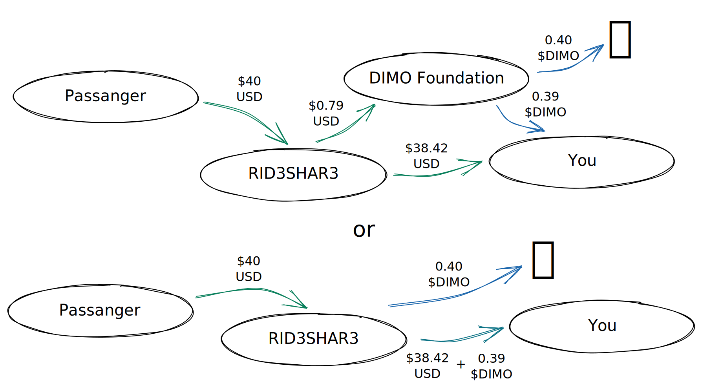

# DIP-3: Amendment 1

> **Headline**: Removing the 1:1 peg when issuing market issuance
>
> **Author**: The DIMO Foundation
>
> **Submitter(s)**: The DIMO Foundation \[0xCED3c922200559128930180d3f0bfFd4d9f4F123]
>
> **Status**: Deployed
>
> **Voting URL**: [Snapshot](https://snapshot.org/#/dimo.eth/proposal/0x32cf0478a7f154d908a7e6295d8333e2cbd997acc9e07f0574972688f11eda94)
>
> **Discussion Forum**: [Discord](https://chat.dimo.zone) #🗳️governance forum
>
> **Vote Type**: [Level 3](../dip1.md#voting-protocol)

## Abstract

This amendment removes the peg for converting fiat or other crypto into $DIMO when marketplace rewards are generated for users. If passed, the DIMO Foundation would 1) provide this service by converting using the market price for $DIMO as determined by popular price oracles and 2) would be able to use its best judgement to limit or deny this service, or to use a higher price for $DIMO if, for example, it determines there isn't sufficient actual volume or genuine price discovery to give legitimacy to the market price.

## Motivation

Given the increased availability of $DIMO and improved regulatory clarity in relevant jurisdictions, the 1:1 USD to $DIMO peg employed in the original of marketplace issuance is no longer needed.

## Specification

_<mark style="color:green;">// If passed, this proposal would incorporate the following changes to the the Specification section of DIP-3:</mark>_

### Market Issuance ~~<mark style="color:red;">from data sales</mark>~~

Users are able to opt-in to sharing data with licensed DIMO Apps. These apps must specify what data they are collecting, what they may do with it, and what portion of any data sales revenue that they will keep, if applicable.

For all transactions involving the sale of user data or access, the amount will be translated to $DIMO tokens and the portion owed to the user will be distributed in $DIMO and 1% of the transaction will be burned.

If the <mark style="color:red;">the transaction is denominated</mark>~~<mark style="color:red;">end data customer pays</mark>~~ in $DIMO, the calculation is obvious. If <mark style="color:red;">denominated or paid</mark>~~<mark style="color:red;">they pay</mark>~~ in fiat (USD, EUR, GBP) or other assets (DAI, BTC, ETH), <mark style="color:red;">amounts are converted to $DIMO at the current market price at the time of the transaction. The node operator may choose between CoinMarketCap and CoinGecko for the price oracle.</mark>~~<mark style="color:red;">$1 USD of value will translate to 1 $DIMO. This exchange rate may be altered by any future governance vote.</mark>~~

The easiest way to understand this mechanism is through examples of various transaction types, all listed below.&#x20;

<mark style="color:red;">For simplicity, these examples assume a market price of $10 USD per $DIMO token and round to two decimal points.</mark>

#### Example 1: The sale of aggregate and anonymized user data

Marketplace Issuance generated by the sale of aggregate and anonymized data is split evenly among all users who are currently opted into and contributing data to that data pool at the time the reward is distributed.

_Hypothetical Example:_ You grant DIMO Explorer, a licensed DIMO App, the right to sell your aggregate and anonymized data when you opt-in to Baseline Rewards. As a part of the opt-in, users agree that Explorer keeps a 5% cut for their efforts, leaving users with 95%. In 2023, Explorer generates $1,000,000 in USD by selling reports on overall traffic patterns, battery performance, self-driving system usage, road quality, and other driving behaviors.

* **Burn**: <mark style="color:red;">1,000 $DIMO ($1,000,000 / 10 $perDIMO x 1%)</mark> <mark style="color:red;"></mark>~~<mark style="color:red;">10,000 $DIMO (1,000,000 x 1%)</mark>~~
* **Settlement**:&#x20;
  * Explorer receives $49,500 USD (<mark style="color:red;">$</mark>1,000,000 x 99% x 5%)
  * <mark style="color:red;">Users receive 94,050 $DIMO ($1,000,000 / 10 $perDIMO x 99% x 95%)</mark> <mark style="color:red;"></mark>~~<mark style="color:red;">Users receive 940,500 $DIMO (1,000,000 x 99% x 95%)</mark>~~

#### Example 2: The sale of disaggregated user data

Marketplace Issuance generated by the direct sale of user data will go to the respective user. 99% of net proceeds are issued to the user and 1% is burned.

_Hypothetical Example:_ You grant DataWiz, a DIMO App, the right to sell your anonymized but disaggregated (vehicle specific data). You share trip telemetry data and vehicle status, but not location or glovebox (license, title, insurance) data. You agree to DataWiz's license agreement that gives them a 5% cut of your data sales.

Verizon subscribes to your cell coverage data so they can map their signal strength. Panasonic subscribes to your battery data, which they use to improve their designs. Other businesses subscribe to similar streams. DataWiz receives an aggregate $60/month in USD from brokering your data.

* **Burn**: <mark style="color:red;">0.06 $DIMO each month ($60 / 10 $perDIMO x 1%)</mark> <mark style="color:red;"></mark>~~<mark style="color:red;">0.60 $DIMO each month (60 x 1%)</mark>~~
* **Settlement**:&#x20;
  * DataWiz receives $2.97/month USD (<mark style="color:red;">$</mark>60 x 99% x 5%)
  * <mark style="color:red;">You receive 5.64 $DIMO per month ($60 / 10 $perDIMO x 99% x 95%)</mark> <mark style="color:red;"></mark>~~<mark style="color:red;">You receive 56.43 $DIMO per month (60 x 99% x 95%)</mark>~~

#### Example 3: Direct incentives

Marketplace Issuance may also be earned directly from apps. Incentives must be in $DIMO. 99% of the incentive is issued to the user and 1% is burned.&#x20;

_Hypothetical Example:_ All Farm Insurance is a DIMO App that gives new customers 50~~<mark style="color:red;">0</mark>~~ $DIMO when they switch to All Farm and share their vehicle health, location, and mileage data for better insurance rates.

* **Burn**: <mark style="color:red;">0.51 $DIMO (50.5 x 1%)</mark> <mark style="color:red;"></mark>~~<mark style="color:red;">5.05 $DIMO (505.05 x 1%)</mark>~~
* **Settlement**:&#x20;
  * <mark style="color:red;">You receive 500 $DIMO (50.50 x 99%)</mark> <mark style="color:red;"></mark>~~<mark style="color:red;">500 $DIMO (505.05 x 99%)</mark>~~

\---

_<mark style="color:green;">// And would make the following changes to the Implementation section.</mark>_

DIMO apps may burn and distribute $DIMO directly. In cases where DIMO apps do not have or wish to use $DIMO, or do not wish to handle the distribution directly, the DIMO Foundation will assist in conversions and distributions. <mark style="color:red;">The DIMO Foundation reserves the right limit or deny the service of assisting third parties in exchanging fiat or other crypto for $DIMO, or to use a higher price for $DIMO if, for example, it determines there isn't sufficient actual volume or genuine price discovery to give legitimacy to the market price, or if the asset being exchanged is difficult or unwise to accept.</mark>

To assist in this matter, the DIMO Foundation has engaged Digital Infrastructure Inc. to process data and calculate distributions. As is the case with Baseline Issuance, user<mark style="color:red;">s</mark> are not eligible for rewards if their wallets are flagged by Chainalysis' [AML tools](https://www.chainalysis.com/free-cryptocurrency-sanctions-screening-tools/) as risky or fraudulent.

## Implementation

If passed, DIP-3 would be updated as specified above after the four day timelock concludes.

## Copyright

Copyright and related rights waived via [CC0](https://creativecommons.org/publicdomain/zero/1.0)

## Citation

Please cite this document as:

The DIMO Foundation, "DIP-3: Amendment 1", March 2023. \[Online serial]. Available: \[[https://github.com/DIMO-Network/DIP](https://github.com/DIMO-Network/DIP)]

## Changelog

## Disclaimer

The contract addresses for $DIMO are [0x5fab9761d60419c9eeebe3915a8fa1ed7e8d2e1b](https://etherscan.io/token/0x5fab9761d60419c9eeebe3915a8fa1ed7e8d2e1b) on Ethereum and [0xE261D618a959aFfFd53168Cd07D12E37B26761db](https://polygonscan.com/token/0xE261D618a959aFfFd53168Cd07D12E37B26761db) on Polygon. Please always confirm that you are interacting with these contract addresses and not those of a fraudulent imitator. This proposal may not be enacted if it violates Cayman Islands law. Please triple check that any communications are authentic as it’s common for scammers to try to trick you into sending them crypto or into revealing your private keys.
