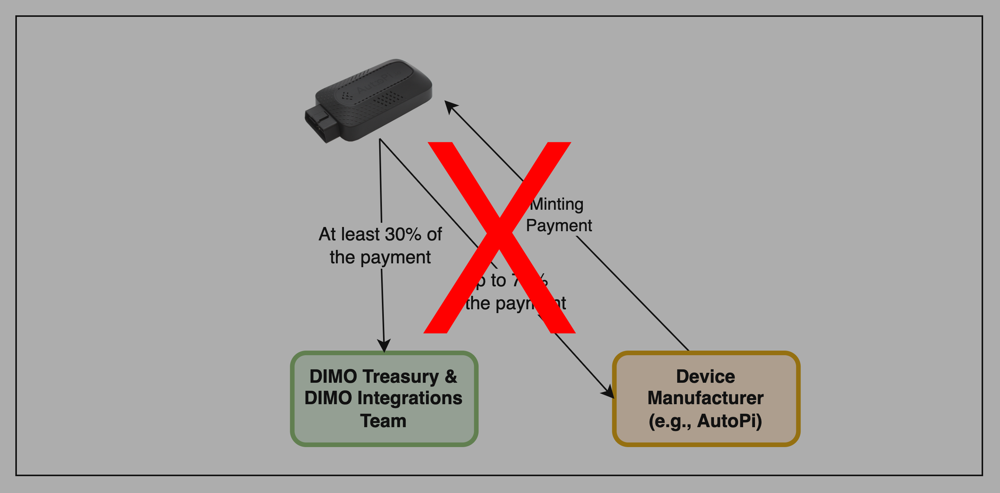
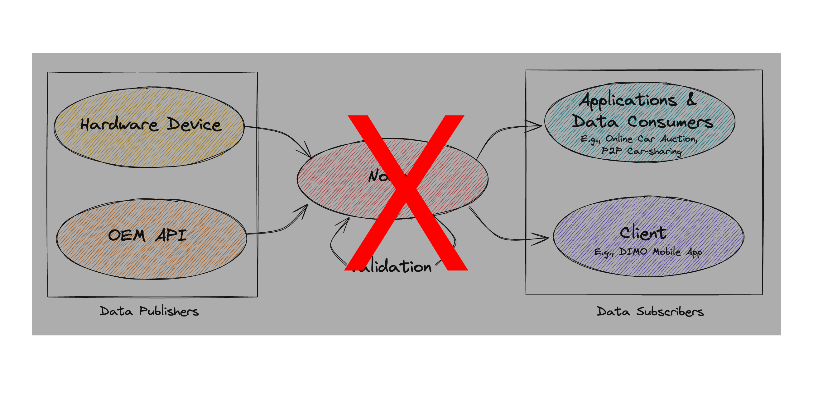

# DIP-4 & 5: Amendment 2

> **Headline**: Rebasing deposits and using DIMO Credits for device minting and developer licensing
>
> **Author**: The DIMO Foundation
>
> **Submitter(s)**: The DIMO Foundation \[0xCED3c922200559128930180d3f0bfFd4d9f4F123]
>
> **Status**: Deployed
>
> **Voting URL**: [Snapshot](https://snapshot.org/#/dimo.eth/proposal/0xf57dc521b222efb380ba44736afbe202b1b06d78382bbdc4e36dfe0e15b5f5e6)
>
> **Discussion Forum**: [Discord](https://chat.dimo.zone) #🗳️governance forum
>
> **Vote Type**: [Level 3](https://docs.dimo.zone/governance/dip1#voting-protocol)

## Abstract

This amendment&#x20;

1. Introduces rebasing events for the deposit amounts for licenses that are paid in $DIMO.
2. Introduces the DIMO Credit (DCX), a stable token always worth $0.0001 in the DIMO ecosystem, created by burning $DIMO based on its market price. Today 100% of the $DIMO used to mint DCX is burned. DCX will be used as the new token for developer licensing and device minting.
3. Switches the device integration cost to use DCX.
4. Simplifies the category formally known as Data Subscriber and replaces the $DIMO license deposit with a one-time DCX payment.

## Motivation

Today, the deposits necessary to acquire any DIMO license, as well as device minting costs, are denominated in $DIMO, making their cost highly variable. Already, the market price of $DIMO has changed by an order of magnitude from when the first pricing was set. By allowing for rebasing and/or using the stable DCX token, we can provide a predictable and fair price for builders without undermining alignment and the role of the $DIMO token.

## Specification

_<mark style="color:green;">// If passed, this proposal would edit the following section within the DIP-4 Abstract section:</mark>_&#x20;

This proposal outlines the method by which hardware manufacturers (like [AutoPi](https://www.autopi.io/)) who produce compatible devices, as well as software developers (like [<mark style="color:red;">Digital Infrastructure Inc.</mark>](https://drivedimo.com)[~~<mark style="color:red;">SmartCar</mark>~~](https://smartcar.com/)) who build digital integrations (collectively referred to as integration providers) bond $DIMO and receive a license.

The requirements for any integration providers are that they must:&#x20;

1. Pass a DIP that approves their license application;
2. Bond ~~<mark style="color:red;">100,000</mark>~~ $DIMO tokens as a security deposit;&#x20;
3. <mark style="color:red;">Pay</mark>~~<mark style="color:red;">Transfer</mark>~~ the applicable amount of <mark style="color:red;">DIMO Credits (DCX)</mark>~~<mark style="color:red;">$DIMO</mark>~~ for each integrations they enable; and
4. Remain in good standing with the community.&#x20;

_<mark style="color:green;">// And would make the following changes to DIP-4 Specification section.</mark>_

### Integration Providers & Device Licenses

In order to connect to DIMO users, their vehicles, and their data, integration providers must agree to various obligations, receive a license by passing a DIP, bond <mark style="color:red;">the required amount of</mark> <mark style="color:red;"></mark>~~<mark style="color:red;">100,000</mark>~~ $DIMO, and <mark style="color:red;">pay DCX</mark>~~<mark style="color:red;">deposit $DIMO</mark>~~ for each device they sell.

...

~~_<mark style="color:red;">Integration Types</mark>_~~&#x20;

~~<mark style="color:red;">All integrations methods must be categorized as one of the following device types. New device types may be added by token holders with a valid governance vote.</mark>~~

<table><thead><tr><th width="150">Device Type</th><th width="154">Concept Image</th><th width="180.02149740548558">Description</th><th width="173">Typical Price Point</th></tr></thead><tbody><tr><td><del><mark style="color:red;">Software Only</mark></del></td><td><del><mark style="color:red;">N/A</mark></del></td><td><del><mark style="color:red;">Leverages existing vehicle subscription programs and their APIs to establish a baseline of connectivity</mark></del></td><td><del><mark style="color:red;">No added charge. Vehicle manufacturer (e.g., Ford, BMW) may charge a subscription fee.</mark></del></td></tr><tr><td><del><mark style="color:red;">Dongle</mark></del></td><td></td><td><del><mark style="color:red;">Records vehicle data from the CAN bus.</mark></del></td><td><del><mark style="color:red;">$350</mark></del></td></tr><tr><td><del><mark style="color:red;">Hub</mark></del></td><td></td><td><del><mark style="color:red;">IoT hub that enables long term local storage and backup of data.</mark></del></td><td><del><mark style="color:red;">$500</mark></del></td></tr><tr><td><del><mark style="color:red;">Dash Camera</mark></del></td><td></td><td><del><mark style="color:red;">Device that records camera footage and possibly other telemetry</mark></del></td><td><del><mark style="color:red;">$500</mark></del></td></tr><tr><td><del><mark style="color:red;">Fleet Device</mark></del></td><td></td><td><del><mark style="color:red;">Telemetry devices designed for commercial use</mark></del></td><td><del><mark style="color:red;">$1,000</mark></del></td></tr><tr><td><del><mark style="color:red;">AI Device</mark></del></td><td></td><td><del><mark style="color:red;">Device that supplements enhanced driving features (e.g., Comma AI)</mark></del></td><td><del><mark style="color:red;">$2,000</mark></del></td></tr></tbody></table>

...

#### Licensing and Bonding

Licenses are NFTs that can only be minted or transferred by DIMO Integrations. These certify the integration provider meets all required qualifications and has been whitelisted for the integration of compatible devices. After receiving a license, the integration provider is required to submit a deposit of ~~<mark style="color:red;">100,000</mark>~~ $DIMO tokens (the “bond”). For more on how this works, see [License](https://app.gitbook.com/s/fmY0p4toAb7e89toAV2R/identity-protocol/nodes-and-nfts/license "mention").

<mark style="color:red;">Periodically, or with a significant change in price of $DIMO, the amount required to bond will rebase automatically. Every year on January 1st, the bond amount automatically adjusts to whatever the amount of $DIMO is that is equivalent to $10,000 USD. Rebasing can also happen within the year, whenever the 7 day token weighted average price (TWAP) of $DIMO changes by 50% or more relative to the price last used to calculate the deposit amount. For example, if $DIMO is worth $2.00 on January 1st, the bond requirement is 5,000 $DIMO. If the price of $DIMO increases to $2.80, there is no change in the deposit amount. Once the token weighted average price over 7 days increases to $3.00, then the bond requirement is rebased to 3,333 $DIMO.</mark>

<mark style="color:red;">If the bond amount is ever decreased, existing license holders have the option to withdraw the excess amount by notifying the DIMO Foundation of their desire to do so. If the bond amount ever increases, the license holder is grandfathered in and not obligated to add additional $DIMO.</mark>

<mark style="color:red;">This DIP may be updated without passing an amendment to update the bond amount below per the rules described herein.</mark>

<mark style="color:red;">**As of the last rebasing on July 5, 2024**</mark>**, the bond amount is&#x20;**<mark style="color:red;">**77,101 $DIMO.**</mark>

<mark style="color:red;">Past bond amounts were:</mark>

* <mark style="color:red;">December 12, 2022: 100,000 $DIMO</mark>

.png>)

While it is preferred that the integration provider is the party putting up the bond, it is also possible for a financing partner, such as a distributor, to put up the bond on behalf of the manufacturer.&#x20;

Should applicants not have $DIMO or not want to interact with tokens, they may purchase $DIMO from the Foundation and/or have the Foundation put up the bond on their behalf.

~~<mark style="color:red;">The bonding amount may be altered by any future governance vote.</mark>~~

#### Slashing & License Revocation&#x20;

~~<mark style="color:red;">Through a governance vote, DIMO token holders have the ability alter the manufacturer’s bonding requirements. Manufacturers must be given thirty days to adjust their bond to the new level.</mark>~~

Token holders are ~~<mark style="color:red;">also</mark>~~ able to ban devices from the network (e.g., if they’re not secure and provide false data) and/or suspend or revoke a manufacturer’s license through a valid governance vote if they violate the obligations specified above or there is demonstrable and material negligence or malice perpetrated by the manufacturer that harms users or the DIMO protocol generally.

Any manufacturer may renounce their license and receive back their bonded $DIMO after six months.

### Connecting a Device to DIMO&#x20;

#### Device Payment Requirements&#x20;

For physical hardware, licensed manufacturers pay a <mark style="color:red;">4,000 DIMO Credits (DCX)</mark>~~<mark style="color:red;">set amount of $DIMO</mark>~~ to mint a device and enable it to connect to the ~~<mark style="color:red;">$</mark>~~DIMO network.

<figure><figcaption></figcaption></figure>

~~<mark style="color:red;">The $DIMO payment is set aside. Each month that the connection persists, the integration provider receives some of that $DIMO back as rebate for twenty four months until they earn back 70%.</mark>~~&#x20;

~~<mark style="color:red;">Why add this complexity? It's to align incentives.</mark>~~

~~<mark style="color:red;">This rebate mechanism ensures that both integration providers and DIMO Integrations are long-term holders of $DIMO and that they have an incentive to produce resilient devices and services that users will love and want to keep connected.</mark>~~

~~<mark style="color:red;">The DIMO Treasury keeps any $DIMO that isn't returned to the manufacturer.</mark>~~

<figure><figcaption></figcaption></figure>

#### ~~<mark style="color:red;">Cost of Device Minting</mark>~~

~~<mark style="color:red;">The amount of DIMO required for device minting varies by device type.</mark>~~

<table><thead><tr><th width="150">Type</th><th width="312">Description</th><th>Cost (in $DIMO)</th></tr></thead><tbody><tr><td><del><mark style="color:red;">Software</mark></del> </td><td><del><mark style="color:red;">Leverages existing vehicle subscription programs and their APIs to establish a baseline of connectivity</mark></del></td><td><del><mark style="color:red;">0</mark></del></td></tr><tr><td><del><mark style="color:red;">Hardware</mark></del></td><td><del><mark style="color:red;">New hardware that users and purchase and install in their vehicle.</mark></del></td><td><del><mark style="color:red;">25</mark></del></td></tr></tbody></table>

~~<mark style="color:red;">Similar to the bond required for licensing, device minting costs may be covered by financing partners, such as a distributor.</mark>~~&#x20;

### ~~<mark style="color:red;">Temporary Licenses</mark>~~

~~<mark style="color:red;">For six months after the passage of this DIP, the following companies have a temporary license. Following six months, they will need to apply for a permanent license per the process defined above.</mark>~~

* [~~<mark style="color:red;">AutoPi Aps</mark>~~](https://www.autopi.io/) ~~<mark style="color:red;">is licensed to produce it's</mark>~~ [~~<mark style="color:red;">DIMO x AutoPi Data Miner</mark>~~](https://shop.dimo.zone/products/dimo-data-device?title=default%2520title)
* [~~<mark style="color:red;">Smartcar</mark>~~](https://smartcar.com/) ~~<mark style="color:red;">is licensed to offer a software connection</mark>~~
* ~~<mark style="color:red;">Digital Infrastructure Inc is licensed to offer a software connection.</mark>~~

_<mark style="color:green;">// And would make the following changes to DIP-5 Abstract section.</mark>_

~~<mark style="color:red;">The DIMO app ecosystem has several main parties:</mark>~~&#x20;

* ~~<mark style="color:red;">**Data Publishers**</mark><mark style="color:red;">: Users connect their devices via hardware and software connections;</mark>~~&#x20;
* ~~<mark style="color:red;">**Nodes**</mark><mark style="color:red;">: receive data from users, validate it, issue proofs of data validity, and serve it to licensed apps and data customers; and</mark>~~
* ~~<mark style="color:red;">**Data Subscribers**</mark><mark style="color:red;">: Products that make use of user data and connectivity.</mark>~~

<mark style="color:red;">**Nodes**</mark> <mark style="color:red;"></mark><mark style="color:red;">store data on behalf of users and make it available to the</mark> <mark style="color:red;"></mark><mark style="color:red;">**developers**</mark> <mark style="color:red;"></mark><mark style="color:red;">with authorization from the user.</mark>&#x20;

This proposal defines how <mark style="color:red;">these two entity types</mark>~~<mark style="color:red;">Nodes, and Data Subscribers will</mark>~~ form, remain in good standing, and interact with users, their data, and the protocol itself. ~~<mark style="color:red;">Data publishers are addressed in DIP-4: Device Integrations.</mark>~~

<figure><figcaption></figcaption></figure>

_<mark style="color:green;">// And would make the following changes to DIP-5 Specification section.</mark>_

### Nodes&#x20;

A Node is an entity that <mark style="color:red;">stores data on behalf of users and makes it available to developers only as authorized by their users</mark>~~<mark style="color:red;">receives data from devices and, after validating it against proof of movement, makes it available to Data Subscribers</mark>~~. These entities are responsible for forming and upholding agreements that protect user privacy and enable DIMO applications.&#x20;

Nodes may receive data from several protocols, such as UDP, MQTT, or Streamr Network. They provide API's and interfaces that can be used to access data, and the on-chain indexer.

All data they receive must be encrypted in transit and at rest. Both Nodes and the businesses that they serve must always comply with relevant privacy regulations (e.g., GDPR). **Node operators may only share data with licensed&#x20;**<mark style="color:red;">**developers**</mark>~~<mark style="color:red;">**Data Subscribers**</mark>~~**&#x20;per the explicit terms of a user's active opt-in**. In other words, any Data Subscriber must receive an explicit signature from a user's wallet in order to receive their data.

<mark style="color:red;">Prospective Nodes may receive a license by passing a DIP that follows the</mark> [<mark style="color:red;">License Approval Template</mark>](../templates/license-approval-template.md) <mark style="color:red;">and by depositing the required $DIMO bond.</mark>

<mark style="color:red;">Periodically, or with a significant change in price of $DIMO, the amount required to bond will rebase automatically. Every year on January 1st, the bond amount automatically adjusts to whatever the amount of $DIMO is that is equivalent to $30,000 USD. Rebasing can also happen within the year, whenever the 7 day token weighted average price (TWAP) of $DIMO changes by 50% or more relative to the price last used to calculate the deposit amount. For example, if $DIMO is worth $2.00 on January 1st, the bond requirement is 15,000 $DIMO. If the price of $DIMO increases to $2.80, there is no change in the deposit amount. Once the token weighted average price over 7 days increases to $3.00, then the bond requirement is rebased to 10,000 $DIMO.</mark>

<mark style="color:red;">If the bond amount is ever decreased, existing license holders have the option to withdraw the excess amount by notifying the DIMO Foundation of their desire to do so. If the bond amount ever increases, the license holder has six months to deposit additional $DIMO to reach the new minimum.</mark>

<mark style="color:red;">This DIP may be updated without passing an amendment to update the bond amount below per the rules described herein.</mark>

<mark style="color:red;">**As of the last rebasing on July 5, 2024, the bond amount is 231,303 $DIMO.**</mark>

<mark style="color:red;">Past bond amounts were:</mark>

* <mark style="color:red;">December 12, 2022: 500,000 $DIMO</mark>

~~<mark style="color:red;">Nodes are to DIMO what Infura or Alchemy are to Ethereum.</mark>~~&#x20;

### <mark style="color:red;">Developers</mark>~~<mark style="color:red;">Data Subscribers</mark>~~&#x20;

<mark style="color:red;">Developers</mark>~~<mark style="color:red;">Data Subscribers</mark>~~ are entities that offer services to users (e.g., a refinancing app) and/or pay users for data (e.g., an electric vehicle R\&D company). <mark style="color:red;">Developers must pay 100,000 DIMO Credits (DCX), which is equivalent to $100 USD, to acquire a developer license.</mark>

#### ~~<mark style="color:red;">Clients</mark>~~&#x20;

~~<mark style="color:red;">A client is a type of application that allows users to interact directly with the DIMO protocol. Typically, this will mean creating and managing their account, creating and managing their vehicle identity, adding and removing credentials in their identity glovebox (e.g., insurance and registration), adding and removing telemetry devices, and viewing back their own data.</mark>~~&#x20;

~~<mark style="color:red;">Clients are to DIMO what Metamask and Rainbow Wallet are to Ethereum.</mark>~~ [~~<mark style="color:red;">DIMO Mobile</mark>~~](https://onelink.to/dimo) ~~<mark style="color:red;">is an example of a client.</mark>~~

#### ~~<mark style="color:red;">Applications</mark>~~&#x20;

~~<mark style="color:red;">An application is a like a light client. It allows users to gain additional value from the protocol by leveraging the data from their vehicle. It will read data and issue commands, but does not mint new vehicles and manage vehicle connections (e.g., pairing a hardware device). Typically this will mean logging in with DIMO to the application and allowing it to access your vehicle data, where the application extends the available insights, enables new savings, or new features on top of the protocol.</mark>~~&#x20;

~~<mark style="color:red;">Some examples of apps include peer-to-peer car rentals, efficient online car marketplaces, defi auto lending, smart insurance, and web3 ride hailing. Uber, Geico, eBay Motors, and Hertz could be rebuilt as leaner, cheaper, and more effective protocols on top of DIMO.</mark>~~ [~~<mark style="color:red;">DIMO Explorer</mark>~~](https://explorer.dimo.zone) ~~<mark style="color:red;">is an  example of an application.</mark>~~&#x20;

#### ~~<mark style="color:red;">Data Consumers</mark>~~

~~<mark style="color:red;">A data consumer is an entity that subscribes to user data. Various businesses will want to purchase traffic, battery, self-driving, video, and other telemetry data. McKinsey published an  overview on the value of data consumption</mark>~~ [~~<mark style="color:red;">here</mark>~~](https://www.mckinsey.com/industries/automotive-and-assembly/our-insights/unlocking-the-full-life-cycle-value-from-connected-car-data)~~<mark style="color:red;">.</mark>~~

### ~~<mark style="color:red;">Licensing</mark>~~

~~<mark style="color:red;">Prospective Clients and Nodes may receive a license by passing a DIP using the</mark>~~ [~~<mark style="color:red;">License Approval Template</mark>~~](../templates/license-approval-template.md)~~<mark style="color:red;">.</mark>~~

~~<mark style="color:red;">Applications and Data Consumers do not require a governance vote to receive a developer license, but must comply with all terms in the Obligations and Bonding sections in order to interact with DIMO Users and their data. The DIMO Foundation is able to issue developer licenses in its discretion.</mark>~~

### ~~<mark style="color:red;">Bonding</mark>~~

~~<mark style="color:red;">Clients, Nodes, Applications, and Data Consumers must bond $DIMO (or must have someone do it on their behalf) as defined below. If a licensee violates their obligations as specified below, their license may be suspended or revoked. They may renounce their license and receive back their bonded deposit six months later.</mark>~~

~~<mark style="color:red;">**Nodes**</mark><mark style="color:red;">: Must bond 500,000 $DIMO as a one-time deposit.</mark>~~

~~<mark style="color:red;">**Clients**</mark><mark style="color:red;">: Must bond 20,000 $DIMO as a one-time deposit.</mark>~~

~~<mark style="color:red;">**Applications & Data Consumers**</mark><mark style="color:red;">: Do not need to bond $DIMO for now.</mark>~~

~~<mark style="color:red;">Should applicants not have $DIMO or not want to interact with tokens, they may purchase $DIMO from the Foundation and/or have the Foundation put up the bond on their behalf.</mark>~~

~~<mark style="color:red;">The amounts for bonding, as well as the exchange rate for $DIMO offered by the Foundation, may be altered by any future governance vote.</mark>~~

### Obligations

~~<mark style="color:red;">Clients, Nodes, Apps, and Data Consumers</mark>~~<mark style="color:red;">Nodes and Developers</mark> commit to maintaining strict quality and security standards, provide support for their services, always act in good faith, and agree not to engage in unlawful activities. The following is illustrative but not exhaustive.

...

### ~~<mark style="color:red;">Temporary Licenses</mark>~~

~~<mark style="color:red;">For six months after the passage of this DIP, the following companies are have a temporary license. Following twelve months, they will need to apply for a permanent license per the process defined above.</mark>~~

* ~~<mark style="color:red;">Digital Infrastructure Inc is licensed to operate:</mark>~~
  * ~~<mark style="color:red;">Node:</mark>~~ [~~<mark style="color:red;">DIMO Web Services</mark>~~](https://devices-api.dimo.zone)
  * ~~<mark style="color:red;">Client:</mark>~~ [~~<mark style="color:red;">DIMO Mobile</mark>~~](https://onelink.to/dimo)

## Implementation

If passed, DIPs 4 & 5 would be udpated and these changes implemented once the software code is audited and ready, or after the four day timelock, whichever is later.

## Copyright

Copyright and related rights waived via [CC0](https://creativecommons.org/publicdomain/zero/1.0)

## Citation

Please cite this document as:

The DIMO Foundation, " DIP 4 & 5 Amendment 2", June 2024. \[Online serial]. Available: \[[https://github.com/DIMO-Network/DIP](https://github.com/DIMO-Network/DIP)]

## Changelog

Feb 7, 2025: Corrected a typo. 1 DCX has always equalled $0.0001 USD, not $0.001 USD

## Disclaimer 

The contract addresses for $DIMO are [0x5fab9761d60419c9eeebe3915a8fa1ed7e8d2e1b](https://etherscan.io/token/0x5fab9761d60419c9eeebe3915a8fa1ed7e8d2e1b) on Ethereum and [0xE261D618a959aFfFd53168Cd07D12E37B26761db](https://polygonscan.com/token/0xE261D618a959aFfFd53168Cd07D12E37B26761db) on Polygon. Please always confirm that you are interacting with these contract addresses and not those of a fraudulent imitator. This proposal may not be enacted if it violates Cayman Islands law. Please triple check that any communications are authentic as it’s common for scammers to try to trick you into sending them crypto or into revealing your private keys.

Certain statements in this document constitute forward-looking statements. The words “may,” “will,” “should,” “project,” “anticipate,” “believe,” “estimate,” “intend,” “expect,” “continue,” and similar expressions or the negatives thereof are generally intended to identify forward-looking statements. Such forward-looking statements, including the intended actions and performance objectives, involve known and unknown risks, uncertainties, and other important factors that could cause the actual results, performance, or achievements to differ materially from any future results, performance, or achievements expressed or implied by such forward-looking statements. There can be no assurance that such statements will prove to be accurate as actual results and future events could differ materially from those anticipated in such statements. Accordingly, readers should not place undue reliance on forward-looking statements and nothing in this document represents a promise of specific work to be completed in the future.
