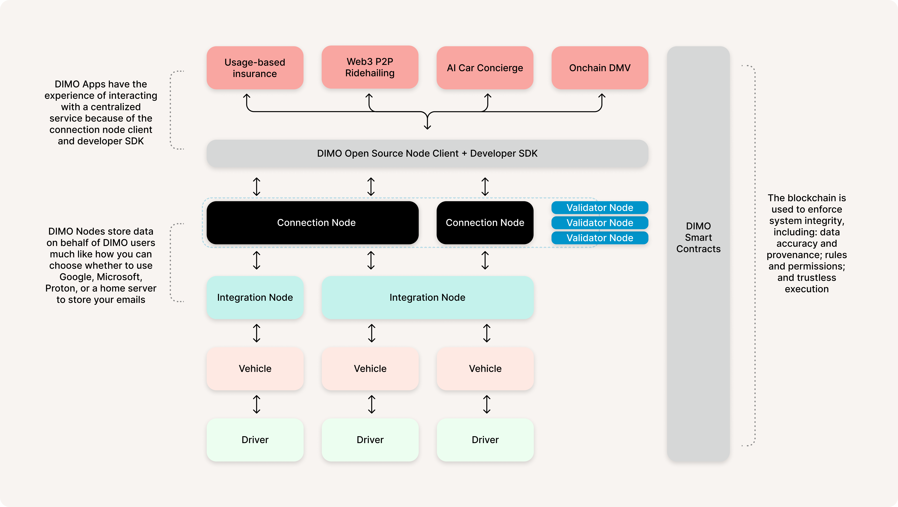
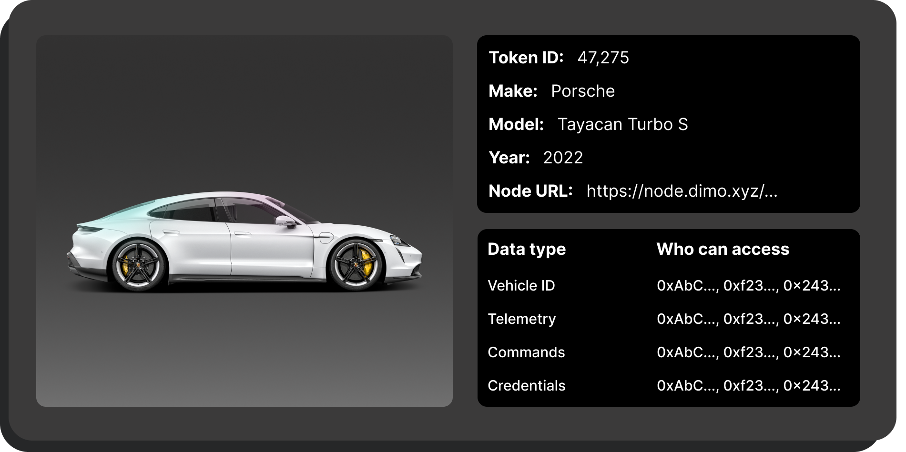
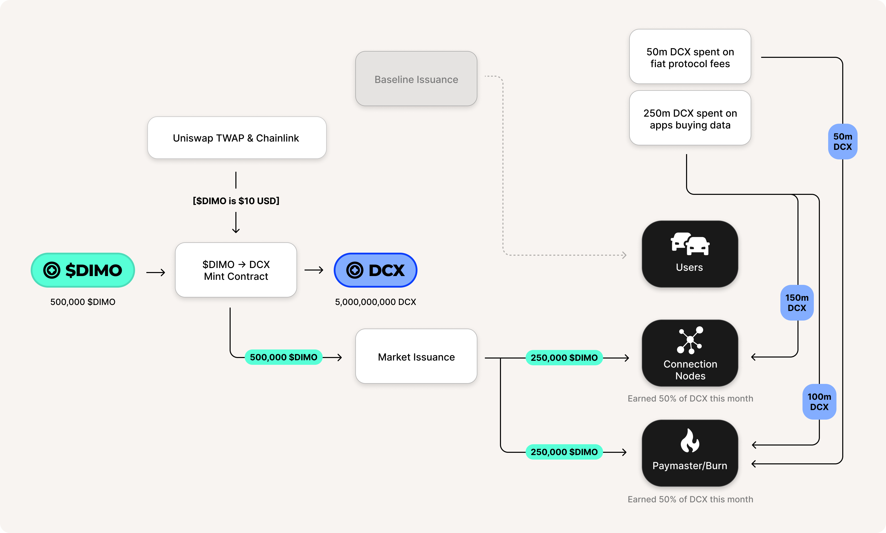
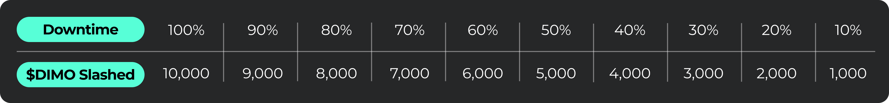

# DIMO Nodes & Token Upgrades

The following outlines a **possible** tokenomic upgrade to the DIMO protocol. **This change is not guaranteed to be implemented and this post is shared for feedback and reference purposes only. You are encouraged to provide add any questions, concerns, or other feedback [here](https://github.com/DIMO-Network/DIP/issues/7).**

It specifies how applications built on DIMO can connect to a vehicle, once they are authorized by the owner, using a stable DIMO Credit (DCX) or with $DIMO. It also specifies how DCX is used in other types of transactions, how $DIMO tokens are converted into DCX, and how some of that $DIMO is recycled and issued as a reward. This model draws inspiration from Helium, particularly the relationship of HNT to Data Credits and Data Transfer rewards.

For convenience, this is written in the style of a post implementation blog post – describing the DIMOverse as if these changes have already been approved and implemented. A governance vote and additional engineering are necessary to implement what is described below.

### What is DIMO

DIMO is the _easiest_ and _most trusted_ way to connect to any car, unlocking innovation in connected mobility and vehicle commerce. Drivers create an onchain digital twin of their vehicle (an NFT); connect their car to the DIMO network to enable the sending of data, commands (e.g., unlock, engine on), and payments to and from their car; and grant access to the apps and services they choose. This allows insurance companies, dealers, fleets, ridehailing platforms, rental companies, mechanics, banks, trafic lights, parking meters, and more to gather consent and securely access vehicles from any automaker and build innovative products.

DIMO is a protocol, and like any true protocol, it harnesses a decentralized network of entities to make itself accessible to users. For example, simple mail transfer protocol (better known as email) wouldn't be what it is without Gmail, Outlook, Apple, Proton, and many others making it usable. These are the "nodes" in the email ecosystem, storing emails, relaying messages, and providing visual interfaces to users.

### What is a DIMO node

DIMO features three different node types that each perform a disctinct function for the network. 

**Integration nodes** are automakers and device manufacturers that enable the streaming of data and commands to and from the car. One car can host multiple integrations at the same time (e.g., an OBD dongle and a dashcam).

**Connection nodes** are entities that store all of the data for a vehicle and enforce secure access. They receive data from, and issue commands to, vehicles via integrations nodes, and they make this data and connectivity available to the applications that vehicle owners grant access to.

**Validator nodes** are any entity that analyzes user data for the express purpose of issuing credentials that increase the verifiability of data, add additional context, or both (e.g., the VIN is unique and verified, the movement and cell tower data verify movement, the vehicle is registered, and the driver is licensed). 

Compare this to a web2 SaaS offering where one company has monopoly control over what is offered, how it's offered, to whom it's offered, at what price, and what constitutes good data. Any other business relying on this connected mobility system would depend entirely on the trust and reliability of this single party. It would also mean that progress and innovation could only happen if and when the network owner delivers it. DIMO's protocol model eliminates the need for these trust assumptions, decentralizes power, and enables open innovation accross the ecosystem.
  

 

  

Although DIMO operates on a distributed architecture, the developer experience is standardized within the protocol and easy to use. This is because every connection node runs a compatible DIMO client.

These clients standardize data ingest from integration nodes and ensure that the APIs to connect to a vehile are homogenous. An application will use the same interface to access the data regardless of the connection node, only the address of the storage node, specified in the VehicleID metadata, changes. 

Leveraging TEEs, auditable cryptographic access control, and uniform endpoints across the network, DIMO provides a consistent and secure structure for developers. Depending on the connection method, this trust can extend all the way to the vehicle's TEE environment, or be bridged via the integration node's TEE.

To help understand, consider other decentralized protocols that feel unified: you submit a transaction to _the Ethereum Mainnet_ regardless of which validator mines it, and you open your browser and access _the internet_ not realizing websites are stored all over the world on different servers. This architecture gives users control and adds resiliency and neutrality to the DIMO Network, without compromising usability.

### DCX & $DIMO

DIMO apps and other businesses wishing to access vehicle data and commands can access it via API, but only when a user gives their consent and only when they pay for it.
  

  

All payments for such access, as well as for other DIMO protocol fees (e.g., the fee to mint a car), require spending DIMO Credits (DCX) or $DIMO. DCX is always worth $0.001 USD, and the only way to generate DCX is by trading in $DIMO, which converts at the market price. E.g., if $DIMO is currently at $10, swapping 1 $DIMO generates 10,000 DCX. When $DIMO is spent to acquire DCX, some is issued to DIMO nodes and some is burned. DCX cannot be converted back into $DIMO and when it is spent, it is burned forever. More on this in [Rewards & burn](dimo-nodes-and-token-upgrades.md#rewards--burn) below.

This conversion process is administered by a series of smart contracts that allows anyone to generate DCX permissionlessly onchain. A combination of Uniswap and Chainlink oracles are used to provide the $DIMO price that is needed to calculate the conversion. To prevent manipulation or system failures, the contract is temporarily halted if these two oracles get out of sync with one another.
  

  

If developers hold $DIMO tokens, they are able mint DCX anytime, or they can simply pay in $DIMO, where conversion to DCX and payment is combined into one step that happens in real-time within the same block.

Developers can also purchase DCX directly from services that have already done this conversion for them. This can be done ahead of time (the developer will hold the DCX) or just in time (the developer pays with fiat to an abstraction service that submits DCX on their behalf). This is beneficial for developers who are not yet ready to make the leap into crypto or accept the volatility that comes with it.

### Using DCX for vehicle data access fees

Once an app developer has a license and a user grants them onchain permission to access their vehicle, they simply use the DIMO SDK to ping the connection nodes and pay the required amount of DCX to access the data they need. The payment gives the app the ability to pull data via API a set number of times per vehicle per data category for one month.
  

  

Additional data types may be added in the future (e.g., video). The price to connect to one car per month is shown below.

Payments are partially refunded if the connection node operator fails to maintain the 97% uptime, in direct proportion to the amount of downtime (e.g., 20% downtime means 20% is refunded). See [Penalties](dimo-nodes-and-token-upgrades.md#penalties) for more.

### Using DCX for flat protocol fees

Previously, hardware manufacturers had to pay 25 $DIMO to mint a hardware device. This was fairly straightforward, but meant that the real cost of minting devices in USD terms was volatile as the price of $DIMO fluctuated. DCX gives us the opportunity to provide a stable price for hardware minting and these new flat protocol fees without undermining the role of the $DIMO token.
  

  

As is this case with paying for API access, users can pay all fees in either DCX or $DIMO, which **includes the blockchain gas cost** covered by the paymaster, meaning that users and apps never need MATIC, ETH, or any other gas token. Applications can also sponsor the cost of all fees paid in DCX or $DIMO if they want to provide the user with a streamlined, entirely gasless and paymentless experience.

$DIMO token holders can always vote to add and adjust fees in the future as the network matures. Some examples include fees to: transfer a digital vehicle title; issue credentials related to maintenance; or register a car with the onchain DMV.

### Rewards & burn

When $DIMO is converted into DCX, that $DIMO is sent into a rewards pool known as the Market Issuance Pool. The name of this pool acknowledges the fact that this pool is funded by demand side market activity, as opposed to the preset [Baseline Issuance Pool](https://docs.dimo.org/governance/improvement-proposals/dip2).

**Each month, all $DIMO in the Market Issuance Pool is partly distributed to connection nodes and partly burned**. The relative amounts are determined based on the proportion of DCX accumulated, calculated as follows:

* 60% of all DCX spent on vehicle data access fees goes to the connection node.
* 40% of all DCX spent on vehicle data access fees and 100% of DCX spent on flat protocol fees is reserved for the DIMO Protocol itself. Any $DIMO that is issued to the DIMO Protocol first replenishes the small amount of resources needed to maintain the paymaster service, and then the rest is burned.
  

  

Integration nodes, validator nodes, and users are not automatically compensated by the protocol. The integration and validator nodes can either charge the user, charge the connection node, or find some other strategic way to monetize or justify their contribution. Users can choose their connection node, and therefore, may choose a connection node that agrees to split rewards with them.

#### **Rewards & burn FAQ**

Q: What happens as the total $DIMO supply continues to burn towards zero?

A: There are a few options:

1. _Automatically Inflate_: DIMO could enact some type of inflationary mechanism (like Ethereum or Bitcoin’s automatic block reward) or equilibrium mechanism (like Helium’s Burn-Mint-Equilibrium) to counterbalance the deflation and provide a long-term incentive that could compensate users and/or nodes.
2. _Mint into the treasury or baseline issuance pool_: The protocol can vote to mint new tokens which could be sold to fund development, added to baseline issuance to increase or extend baseline rewards, or used in some other way; 
3. _Do nothing_: This is the current default option. Even in the most optimistic scenario, $DIMO is unlikely to burn to zero given that $DIMO converts to DCX at market price and is divisible to 18 decimal points (1b $DIMO \* 10^18 decimal points = one octillion units of $DIMO); and/or
4. _Token split_: DIMO could enact a rebase or split, although this may have unfortunate tax consequences for individuals in various jurisdictions.

***

Q: Why have a DCX at all rather than simply using $DIMO?

A: This is the simplest way to address the needs of businesses (who perhaps cannot hold most crypto or don’t want to experience volatility) and to develop DIMO Protocol smart contracts that charge fees at stable prices globally.

***

Q: Why not issue the $DIMO in the period where the DCX is spent rather than the immediate period following when it was minted?

A: DCX is a fungible token meaning that it’s impossible to say when the $DIMO was spent to create that DCX. This approach makes a bet that the minting of DCX and spending of it grows smoothly and in relative balance over time.

***

Q: Why issue rewards monthly instead of weekly or instantly?

A: First, node operators are responsible for delivering data on a monthly cycle and they should not be rewarded in week 1 if they go down in weeks 2-4. Second, this helps smooth out irregularities to reduce manipulated or unfair outcomes.

### Being a connection node operator

#### **How to run a node**

Running a connection node on DIMO is fairly straightforward. Operators must:

1. Ensure that their equipment meets the minimum requirements;
2. Bond the required amount of $DIMO tokens in order to mint a license, which is represented by a non-transferrable NFT;
3. Install and run a compatible DIMO client (free to use and open source); and
4. Maintain good up-time and top of the bond in the event of slashing.

#### **Penalties**

As previously described in [Using DCX for vehicle data access fees](dimo-nodes-and-token-upgrades.md#using-dcx-for-vehicle-data-access-fees), a node and user only earn the full amount of DCX when there is 3% or less downtime in a given month. Above this threshold, nodes and users will miss out on DCX in proportion to the downtime percentage. Additionally, when downtime is at or above 10%, nodes are subject to additional slashing penalties per the simple formula dB * 1%, where d is the percent downtime for the month and B is the required bond amount set by the DIMO protocol for node operators (currently 100,000 $DIMO).

This would result in the following slashing penalties for downtime for a given month.
  

  
If a Node’s bonded amount drops below 80% of the required amount (currently that’s 100,000 * 80% = 80,000 $DIMO), they will have two months to replenish their bond before their license is revoked.
